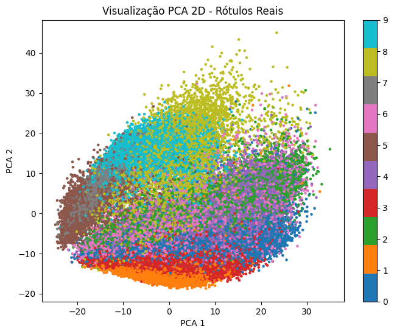
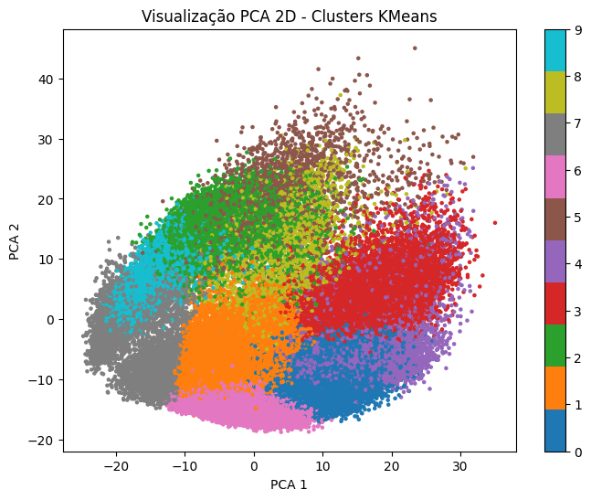
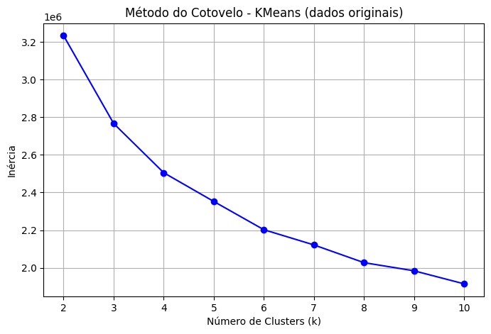
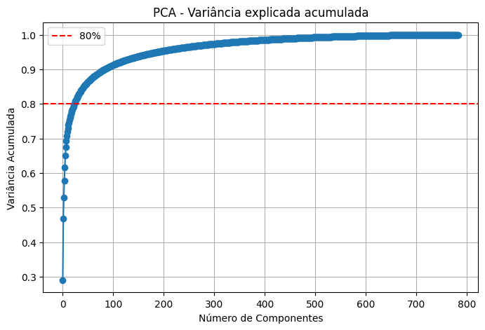
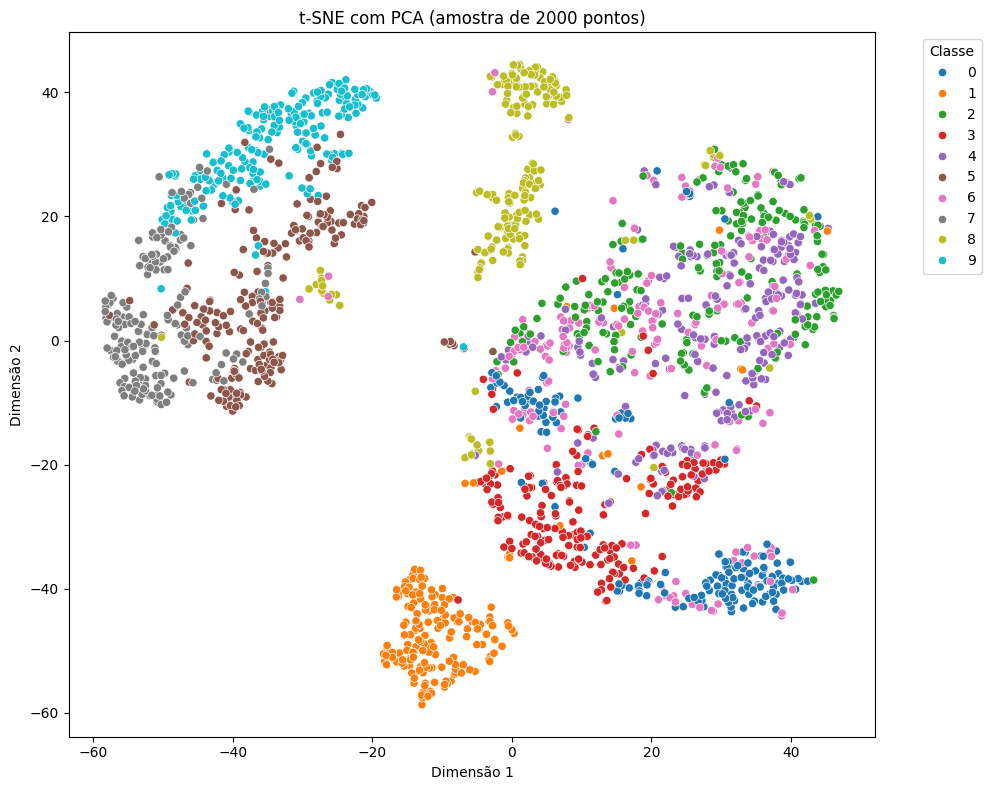

# 🧠 Projeto Final - Clusterização e Redução de Dimensionalidade

Este projeto tem como objetivo aplicar técnicas de **clusterização** e **redução de dimensionalidade** para explorar o dataset **Fashion MNIST**, que contém imagens de peças de roupas organizadas em 10 categorias.

## 👨‍💻 Autor

- **Arthur Rodrigues Passos**
- Especialização em Inteligência Artificial e Ciência de Dados – UFES

---

## 📌 Objetivos do Projeto

- Pré-processar e normalizar os dados do Fashion MNIST.
- Explorar agrupamentos latentes com **K-Means**, **DBSCAN** e **Agglomerative Clustering**.
- Aplicar **PCA** para redução de dimensionalidade e visualização.
- Utilizar **t-SNE** para melhorar a representação visual dos clusters.
- Avaliar o desempenho dos algoritmos com métricas como:
  - Silhouette Score
  - Davies-Bouldin Index
  - Calinski-Harabasz Score

---

## 📦 Sobre o Dataset

- **Fonte:** [Fashion MNIST - Zalando Research](https://github.com/zalandoresearch/fashion-mnist)
- **Formato:** 70.000 imagens em tons de cinza, 28x28 pixels
- **Número de classes:** 10 (roupas e acessórios)
- **Features:** 784 (imagens achatadas)

---

## ⚙️ Etapas Realizadas

### Parte I – Análise Inicial

- Aplicação de `StandardScaler` para normalização
- Visualização dos dados com **PCA (2D)**  
- Testes com:
  - **K-Means** (10 clusters)
  - **DBSCAN**
  - **Agglomerative Clustering**
- Métricas aplicadas nos resultados dos clusters
- Comparação visual entre clusters e rótulos reais

### Parte II – Refinamento e Avaliação

- Análise de variância explicada com **PCA**
- Redução para 50 componentes principais (~80% da variância)
- Aplicação de **t-SNE** sobre dados reduzidos para visualização
- Método do cotovelo para seleção de `k` ideal
- Aplicação do **KMeans** com e sem PCA
- Comparação entre os resultados usando métricas quantitativas

---

## 📊 Resultados e Métricas

| Métrica                      | Com PCA (50D) | Dados Originais | Melhor resultado |
|-----------------------------|---------------|------------------|------------------|
| **Silhouette Score**        | 0.1726        | 0.1518           | ✅ PCA           |
| **Davies-Bouldin Score**    | 1.7981        | 1.8738           | ✅ PCA           |
| **Calinski-Harabasz Score** | 10443.57      | 7579.06          | ✅ PCA           |

> A redução de dimensionalidade via PCA melhorou a separação dos clusters e reduziu o custo computacional.

---

## 🖼️ Visualizações

| Gráfico                                                        | Descrição                                   |
|---------------------------------------------------------------|---------------------------------------------|
|            | PCA 2D com rótulos reais                    |
|                        | PCA 2D com clusters do KMeans               |
|                          | Método do cotovelo para definir k           |
|          | Variância acumulada dos componentes do PCA  |
|                          | t-SNE com dados reduzidos via PCA (sample)  |

---

## ✅ Conclusões

- O uso combinado de **PCA + t-SNE** trouxe ganhos significativos na separação visual dos grupos.
- **KMeans** teve melhor desempenho com dados reduzidos, tanto em termos de coesão quanto de separação.
- O projeto mostra a importância da **redução de dimensionalidade** em problemas de alta dimensionalidade, como imagens.
- Resultados promissores para uso em pré-processamento de tarefas supervisionadas ou pipelines de machine learning.

---

## 📚 Tecnologias Utilizadas

- Python 3.10+
- Pandas, NumPy
- Scikit-learn
- Matplotlib, Seaborn

---

## 📁 Estrutura do Projeto

